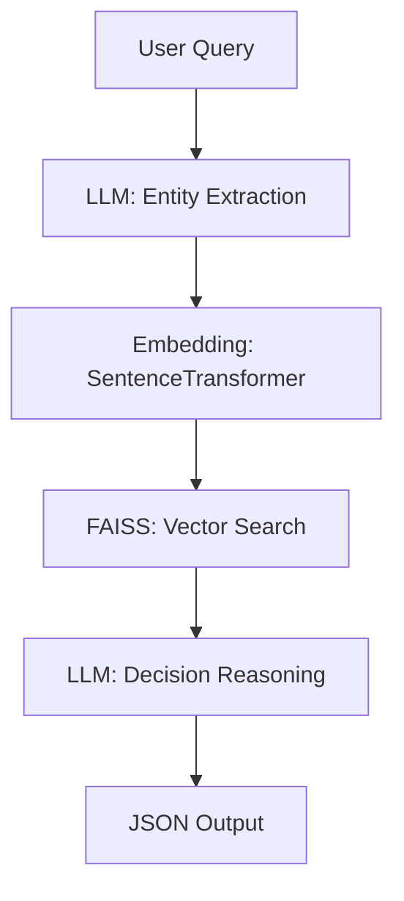

<<<<<<< HEAD
# 🧠 ClauseMind – Intelligent Clause Retriever & Decision System

An intelligent system that uses LLM-powered semantic search to retrieve relevant clauses from insurance documents and provide automated decision-making.

## 🚀 Features

- **Document Upload**: Upload PDF insurance documents
- **Semantic Search**: Find relevant clauses using FAISS vector search
- **LLM Reasoning**: Use Gemini to analyze clauses and make decisions
- **Entity Extraction**: Automatically extract key information from queries
- **Async Processing**: Fast, scalable API with async support
- **Swagger UI**: Interactive API documentation

## 🏗️ Architecture



## 🛠️ Tech Stack

| Component | Technology | Purpose |
|-----------|------------|---------|
| **Backend** | FastAPI | Async API framework |
| **Embeddings** | SentenceTransformers (MiniLM) | Text embedding generation |
| **Vector DB** | FAISS | Fast similarity search |
| **LLM** | Google Gemini | Reasoning and entity extraction |
| **Document Processing** | PyPDF2 | PDF text extraction |
| **Orchestration** | LangChain | LLM integration |

## 📦 Installation

1. **Clone the repository**
   ```bash
   git clone <repository-url>
   cd clause-mind
   ```

2. **Install dependencies**
   ```bash
   pip install -r requirements.txt
   ```

3. **Set up environment variables**
   Create a `.env` file in the root directory:
   ```env
   GEMINI_API_KEY=your_gemini_api_key_here
   MODEL_NAME=gemini-pro
   EMBEDDING_MODEL=all-MiniLM-L6-v2
   CHUNK_SIZE=1000
   CHUNK_OVERLAP=200
   TOP_K_RETRIEVAL=5
   ```

4. **Get Gemini API Key**
   - Visit [Google AI Studio](https://makersuite.google.com/app/apikey)
   - Create a new API key
   - Add it to your `.env` file

## 🚀 Quick Start

1. **Run the application**
   ```bash
   python -m app.main
   ```

2. **Access the API**
   - API Documentation: http://localhost:8000/docs
   - Health Check: http://localhost:8000/api/v1/health

3. **Upload a document**
   ```bash
   curl -X POST "http://localhost:8000/api/v1/upload" \
        -H "accept: application/json" \
        -H "Content-Type: multipart/form-data" \
        -F "file=@your_insurance_policy.pdf"
   ```

4. **Query the system**
   ```bash
   curl -X POST "http://localhost:8000/api/v1/query" \
        -H "accept: application/json" \
        -H "Content-Type: application/json" \
        -d '{"query": "46M, knee surgery, Pune, 3-month policy"}'
   ```

## 📋 API Endpoints

### Health Check
```http
GET /api/v1/health
```

### Upload Document
```http
POST /api/v1/upload
Content-Type: multipart/form-data
```

### Process Query
```http
POST /api/v1/query
Content-Type: application/json

{
  "query": "46M, knee surgery, Pune, 3-month policy",
  "top_k": 5
}
```

### Get Document Info
```http
GET /api/v1/documents
```

## 📊 Example Response

```json
{
  "query": "46M, knee surgery, Pune, 3-month policy",
  "extracted_entities": {
    "age": "46M",
    "procedure": "knee surgery",
    "location": "Pune",
    "policy_type": "3-month policy",
    "duration": "3-month"
  },
  "decision": "approved",
  "amount": "covered under in-patient hospitalization",
  "justification": "Clause I.1 specifies surgical procedures like knee replacement are covered if hospitalization is medically necessary",
  "referenced_clauses": [
    "If You are advised Hospitalization within India by a Medical Practitioner ... surgical appliances ... orthopedic implants ..."
  ],
  "retrieved_chunks": [
    {
      "content": "If You are advised Hospitalization within India by a Medical Practitioner...",
      "score": 0.85,
      "metadata": {"source": "policy.pdf", "chunk_id": 0}
    }
  ]
}
```

## 🔧 Configuration

### Environment Variables

| Variable | Default | Description |
|----------|---------|-------------|
| `GEMINI_API_KEY` | Required | Google Gemini API key |
| `MODEL_NAME` | `gemini-pro` | Gemini model to use |
| `EMBEDDING_MODEL` | `all-MiniLM-L6-v2` | SentenceTransformer model |
| `CHUNK_SIZE` | `1000` | Document chunk size |
| `CHUNK_OVERLAP` | `200` | Chunk overlap size |
| `TOP_K_RETRIEVAL` | `5` | Number of chunks to retrieve |

### Model Parameters

- **Embedding Model**: `all-MiniLM-L6-v2` (384 dimensions, fast and accurate)
- **LLM Model**: `gemini-pro` (high-quality reasoning)
- **Temperature**: 0.1 (consistent outputs)
- **Max Tokens**: 2048 (sufficient for detailed responses)

## 📁 Project Structure

```
clause-mind/
├── app/
│   ├── __init__.py
│   ├── main.py                 # FastAPI application
│   ├── routes/
│   │   ├── __init__.py
│   │   └── query_router.py     # API endpoints
│   └── utils/
│       ├── __init__.py
│       ├── pdf_loader.py       # PDF processing
│       ├── embeddings.py       # Text embeddings
│       ├── vectorstore.py      # FAISS vector store
│       └── llm_reasoner.py     # LLM reasoning
├── data/                       # Documents and indexes
├── config.py                   # Configuration
├── requirements.txt            # Dependencies
└── README.md                   # This file
```

## 🧪 Testing

### Manual Testing

1. **Health Check**
   ```bash
   curl http://localhost:8000/api/v1/health
   ```

2. **Upload Test Document**
   ```bash
   curl -X POST "http://localhost:8000/api/v1/upload" \
        -F "file=@data/sample_insurance_policy.pdf"
   ```

3. **Test Query**
   ```bash
   curl -X POST "http://localhost:8000/api/v1/query" \
        -H "Content-Type: application/json" \
        -d '{"query": "What is covered for knee surgery?"}'
   ```

### Sample Queries

- `"46M, knee surgery, Pune, 3-month policy"`
- `"What is the coverage for dental procedures?"`
- `"Is pre-existing condition covered?"`
- `"What is the claim process for hospitalization?"`

## 🔒 Security Considerations

- **API Key Management**: Store Gemini API key securely
- **CORS**: Configure allowed origins in production
- **File Upload**: Validate file types and sizes
- **Rate Limiting**: Implement rate limiting for production use

## 🚀 Deployment

### Local Development
```bash
python -m app.main
```

### Production (Gunicorn)
```bash
pip install gunicorn
gunicorn app.main:app -w 4 -k uvicorn.workers.UvicornWorker
```

### Docker
```dockerfile
FROM python:3.9-slim
WORKDIR /app
COPY requirements.txt .
RUN pip install -r requirements.txt
COPY . .
CMD ["python", "-m", "app.main"]
```

## 🤝 Contributing

1. Fork the repository
2. Create a feature branch
3. Make your changes
4. Add tests if applicable
5. Submit a pull request

## 📄 License

This project is licensed under the MIT License - see the LICENSE file for details.

## 🆘 Support

For support and questions:
- Create an issue in the repository
- Check the API documentation at `/docs`
- Review the health endpoint at `/api/v1/health`

---

**Built with ❤️ using FastAPI, LangChain, and Google Gemini** 
=======
# DocuClaim
>>>>>>> dce3533ceda687ce3333d846bdfbf37d598d1d37
